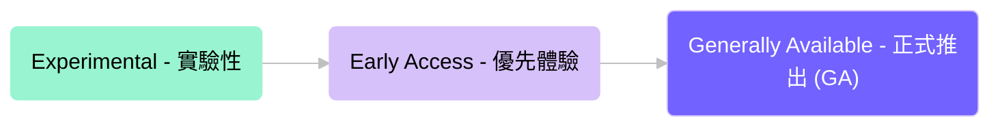

## 功能生命週期

### Experimental (實驗性)

實驗性階段是我們探索新點子並測試概念驗證 (PoC) 的時期。

- 我們仍在構建核心功能，因此內容可能不完整或不穩定。
- 在疊代過程中，我們可能會在未提前通知的情況下做出重大變更 (Breaking changes)。
- 造訪權限僅限於我們的內部團隊與設計合作夥伴。
- 設計合作夥伴會協助我們確定功能應具備哪些能力以及如何運作。
- 我們處於完全由反饋驅動的開發模式。

### Early Access (優先體驗)

優先體驗功能具備穩定性且運作良好，但我們仍根據您的反饋積極進行測試與改進。

- 運作流暢且效能良好。
- 我們可能仍會根據您的回饋進行一些調整。
- 我們提供完整的說明文件。
- 極少發生重大變更，且若發生，我們一定會提前通知。
- 我們的支援團隊已準備好提供協助。
- 在微調階段，我們可能會實施一些使用限制。
- 我們正為該功能的正式 GA 發佈做準備。

### Generally Available (正式推出 / GA)

GA 功能已具備生產水準，並由我們的團隊提供完整支援。

- 我們提供完整的說明文件與培訓教材。
- 這些功能非常穩定，且我們承諾維持向下相容性 (Backward compatibility)。

## 使用功能成熟度分級

這些分級能協助您了解各功能的預期穩定性與效能，以便您決定哪些功能適合您的生產環境與風險承受度。

當您在評估功能是否適用於您的場景時，建議將成熟度分級與您對穩定性、支援及向下相容性的需求一併納入考量。
